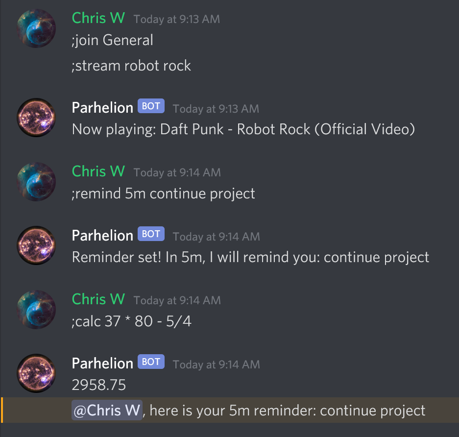
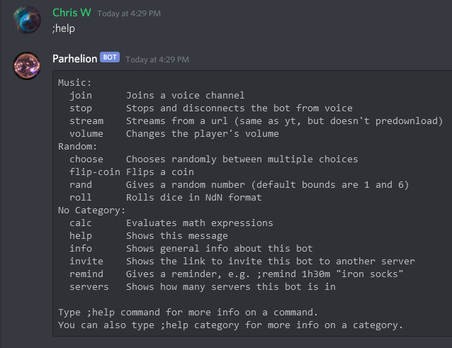

# Parhelion

A simple Discord bot that can play music, solve math questions, and send reminders.

## how to try this bot
There are two ways you can add this bot to Discord servers where you have "manage server" permissions:

1. By adding my instance of the bot to your server by clicking [this link](https://discordapp.com/api/oauth2/authorize?scope=bot&client_id=836071320328077332&permissions=3300352).
2. By making a fork of this repl and creating your own instance of the bot (see instructions below).

After adding this bot, you can see all the commands by entering `;help` and `;hhelp`.

## how to create your own instance of this bot
1. Create a Discord bot account ([see this guide](https://www.freecodecamp.org/news/create-a-discord-bot-with-python/)), except don't create an `.env` file because Replit doesn't use those anymore. Instead, follow [this guide](https://docs.replit.com/repls/secrets-environment-variables) to set a Replit environment variable called `DISCORD_BOT_SECRET_TOKEN`.
2. Optionally set an environment variable called `MY_USER_ID` with your Discord ID if you want to use the `r` command, which repeats your previous command.
3. To keep the bot running continuously without Replit's premium "always on" option, you can use a free UptimeRobot account as explained in the first guide linked above. Replit isn't designed to host bots, so you will want to change hosts soon if you continue using this.

## guides
Here are some guides to making Discord bots that I found helpful:
* https://ritza.co/showcase/repl.it/building-a-discord-bot-with-python-and-repl-it.html
* https://www.freecodecamp.org/news/create-a-discord-bot-with-python/
* https://discordpy.readthedocs.io/en/latest/index.html
* https://github.com/Rapptz/discord.py/tree/v1.7.1/examples
* https://discord.com/developers/docs/intro

## commands
Here are some of this bot's commands. This image will not always be kept up-to-date.

